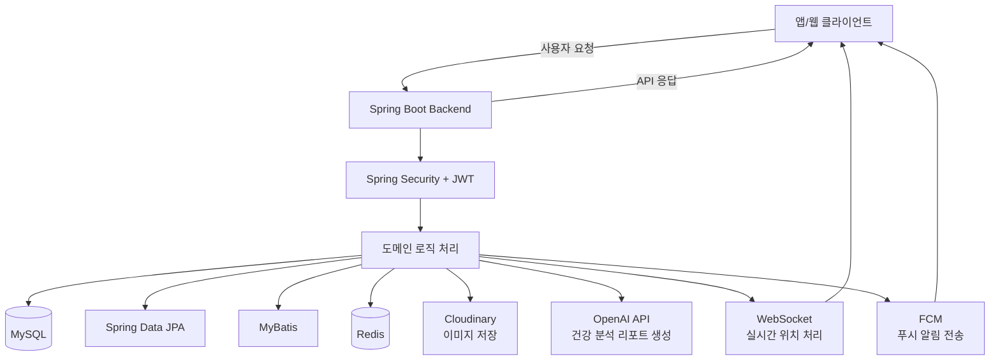
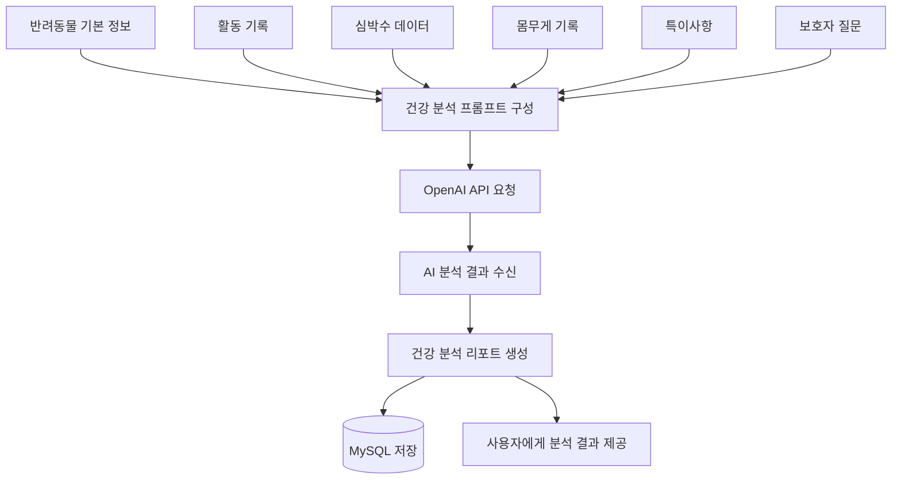
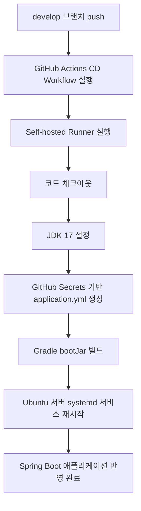

## ✨ 백엔드 주요 기능 (Key Backend Features)

- **✅ 사용자 및 펫 관리**
  > 회원 가입/로그인, Google/Naver 소셜 로그인 <br>
  > JWT 기반 인증/인가, 이메일 인증 <br>
  > 펫 등록, 정보 수정, 이미지 관리, 가족 권한 관리

- **✅ 활동 및 건강 데이터 관리**
  > 활동 기록, 심박수, 몸무게 기록 저장 및 조회 <br>
  > 반려동물 누적 데이터를 기반으로 건강 상태 분석 <br>
  > 건강 리포트 생성 및 조회

- **✅ 산책 경로 및 위치 관리**
  > GPS 기반 위치 좌표 저장 및 산책 경로 관리 <br>
  > 안전 구역(Geo-fencing) 설정 및 이탈 감지 구조 <br>
  > WebSocket 기반 실시간 위치 추적 기능 확장 가능

- **✅ AI 건강 분석**
  > 반려동물 기본 정보, 활동 기록, 심박수, 몸무게 데이터를 조합 <br>
  > OpenAI API 기반 건강 분석 리포트 생성 <br>
  > 보호자가 이해하기 쉬운 건강 관리 가이드 제공

- **✅ 커뮤니티**
  > 게시글 작성/조회/수정/삭제 <br>
  > 댓글, 반응, 신고 기능 <br>
  > 관리자 기능을 통한 커뮤니티 운영 관리

- **✅ 알림 및 푸시**
  > Firebase Cloud Messaging(FCM) 기반 푸시 알림 <br>
  > 울타리 이탈, 댓글/반응 등 주요 이벤트 알림 구조 <br>
  > 사용자별 FCM 토큰 관리

- **✅ 파일 및 이미지 관리**
  > Cloudinary 기반 이미지 업로드 <br>
  > 반려동물 이미지 및 커뮤니티 이미지 저장 <br>
  > Apache Tika 기반 파일 타입 검증 구조

- **✅ 배포 자동화**
  > GitHub Actions 기반 CD Workflow <br>
  > Self-hosted Runner를 활용한 Ubuntu 서버 자동 배포 <br>
  > develop 브랜치 push 시 빌드 및 애플리케이션 재시작

## ⚙️ 기술 스택 (Tech Stack)

<div align="center">

### Backend & Infrastructure
<p>


</p>

### Database & Persistence
<p>


</p>

### Auth & External API
<p>


</p>

### Real-time & Notification
<p>


</p>

</div>

## 🤖 백엔드 아키텍처 (Backend System Architecture)

백엔드 서버를 중심으로 사용자, 반려동물, 활동 기록, 위치, 건강 분석, 커뮤니티 데이터가 처리되는 구조입니다.

<br>

**처리 흐름**



<br>

**도메인 패키지 구성**

```text
📦 src/main/java/com/dodo/backend
┣ 📂 activityhistory    # 반려동물 활동 기록 관리
┣ 📂 admin              # 관리자 기능
┣ 📂 auth               # 로그인, 소셜 로그인, JWT 인증
┣ 📂 board              # 커뮤니티 게시글
┣ 📂 comment            # 댓글
┣ 📂 common             # 공통 응답, 예외, 설정, 핸들러
┣ 📂 fence              # 안전 구역 및 울타리 관리
┣ 📂 fcm-tokens         # FCM 토큰 관리
┣ 📂 healthanalysis     # AI 기반 건강 분석
┣ 📂 heartrate          # 심박수 데이터 관리
┣ 📂 imagefile          # 이미지 파일 관리
┣ 📂 mail               # 이메일 발송
┣ 📂 notification       # 알림 관리
┣ 📂 pet                # 반려동물 정보 관리
┣ 📂 petspecialnote     # 반려동물 특이사항 관리
┣ 📂 petweight          # 반려동물 몸무게 기록
┣ 📂 reaction           # 게시글 반응
┣ 📂 report             # 신고 및 리포트
┣ 📂 routepoint         # 위치 좌표 및 산책 경로 포인트
┣ 📂 user               # 사용자 정보 관리
┗ 📂 userpet            # 사용자-반려동물 관계 관리
```

## 🔐 인증 구조 (Authentication)

DoDo 백엔드는 JWT 기반 인증 구조를 사용합니다.

```text
1. 사용자가 일반 로그인 또는 소셜 로그인을 요청합니다.
2. 서버는 사용자 정보를 검증합니다.
3. 인증에 성공하면 Access Token과 Refresh Token을 발급합니다.
4. 클라이언트는 보호된 API 요청 시 Authorization Header에 Access Token을 포함합니다.
5. 서버는 JWT를 검증한 뒤 사용자 권한에 따라 요청을 처리합니다.
```

## 🗄️ 데이터 처리 방식 (Database & Persistence)

| 구분            | 기술              | 역할                                       |
| ------------- | --------------- | ---------------------------------------- |
| Main Database | MySQL           | 사용자, 반려동물, 활동 기록, 커뮤니티 데이터 저장            |
| ORM           | Spring Data JPA | 도메인 엔티티 중심의 기본 CRD 처리                    |
| SQL Mapper    | MyBatis         | 복잡한 조회, 통계성 데이터 조회 및 직접 SQL 기반 Update 처리 |
| Cache         | Redis           | 빠른 조회 및 인증/세션성 데이터 처리                    |
| File Storage  | Cloudinary      | 반려동물 이미지 및 커뮤니티 이미지 저장                   |

## 🤖 AI 건강 분석 (AI Health Analysis)

DoDo는 반려동물의 누적 데이터를 기반으로 AI 건강 분석 기능을 제공합니다.



## 🚀 배포 구조 (Deployment)

DoDo 백엔드는 GitHub Actions와 Self-hosted Runner를 활용하여 배포를 자동화합니다.



## 🤝 Conventions

우리 프로젝트는 원활한 협업을 위해 아래와 같은 규칙을 따릅니다.

- **[Commit Convention](./.github/COMMIT_CONVENTION.md)**

## 📊 백엔드 참고자료 출처 (Reference)

👉🏻 **[Spring Boot 공식 문서](https://spring.io/projects/spring-boot)**  
👉🏻 **[Spring Security 공식 문서](https://spring.io/projects/spring-security)**  
👉🏻 **[Firebase Cloud Messaging 공식 문서](https://firebase.google.com/docs/cloud-messaging)**  
👉🏻 **[OpenAI API 공식 문서](https://platform.openai.com/docs)**  
👉🏻 **[Cloudinary 공식 문서](https://cloudinary.com/documentation)**

## 💁‍♂️ 팀원 소개 (Team Members)

<table align="center">
  <tr>
    <td align="center">
      <a href="https://github.com/WhiteBin-bin">
        <br>
        <b>백현빈</b>
      </a>
    </td>
    <td align="center">
      <a href="https://github.com/limhb708">
        <br>
        <b>임현빈</b>
      </a>
    </td>
  </tr>
</table>

